Obsidian Barcode Generator
==========================

A plugin for [obsidian](https://obsidian.md/) that generates and displays barcodes in different variations. It uses the [JsBarcode](https://github.com/lindell/JsBarcode) plugin to generate the barcode.

For a plugin that generates qr codes, you might check [this repository](https://github.com/rudimuc/obsidian-qrcode).

## Installation

### From Obsidian

You can activate this plugin within Obsidian by doing the following:

  - Open Settings > Comunity Plugins;
  - Make sure the Restricted Mode is off;
  - Click on Browse community plugins;
  - Search for "Barcode";
  - Click Install;
  - Don't forget to enable it before using.

### Mobile

This plugin works on mobile as well. The installation processs is the same as on desktop.

### Manual Installation

You can download this plugin manually from the [latest releases](https://github.com/noxonad/obsidian-barcode-generator/releases). Copy the `main.js` and `manifest.json` into `<vault>/.obsidian/plugins/obsidian-barcode`. Then you can enable the plugin from `Comunity Plugins` in obsidian.

## Usage

For an insertion of the default barcode, you can use the following codeblock structure:
````markdown
```barcode
content
```
````

If you want to select a specific type of barcode, you can type dash and then the barcode types:

````markdown
```barcode-code128
content
```
````

Note: after changing the options, the barcodes on the page won't be refreshed.

### Barcodes

As for now, the following barcodes are supported:
| Codeblock          | Name       | Description                                                                                                                                                                                                      | Image                             |
| ------------------ | ---------- | ---------------------------------------------------------------------------------------------------------------------------------------------------------------------------------------------------------------- | --------------------------------- |
| barcode-code128    | Code 128   | Automatic selection of Code 128. It has a range of 30 characters or 60 digits.                                                                                                                                   | 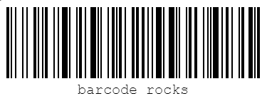       |
| barcode-code128a   | Code 128 A | Encodes ASCII characters 00 to 95 (0–9, A–Z and control codes), special characters, and FNC 1–4.                                                                                                                 | 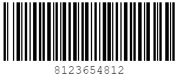     |
| barcode-code128b   | Code 128 B | Encodes ASCII characters 32 to 127 (0–9, A–Z, a–z), special characters, and FNC 1–4.                                                                                                                             | 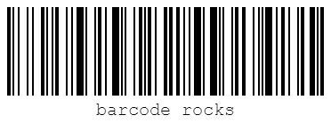     |
| barcode-code128c   | Code 128 C | 00–99 (encodes two digits with a single code point) and FNC1.                                                                                                                                                    | 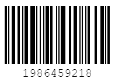     |
| barcode-ean13      | EAN-13     | Encodes 13 digits. Used in labeling products. The last digit is a checksum. If the last digit is not specified, it'll be automatically generated.                                                                | 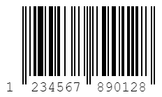           |
| barcode-upc        | UPC        | Encodes 12 digits. Used in labeling products. The last digit is a checksum. If the last digit is not specified, it'll be automatically generated.                                                                | 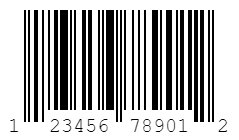               |
| barcode-ean8       | EAN-8      | Encodes 8 ditis. The last digit is a checksum. If the last digit is not specified, it'll be automatically generated.                                                                                             | 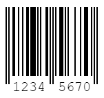             |
| barcode-ean5       | EAN 5      | Encodes 5 digits.                                                                                                                                                                                                | 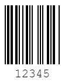             |
| barcode-ean2       | EAN 2      | Encodes 2 digits.                                                                                                                                                                                                | 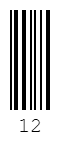             |
| barcode-code39     | Code 39    | Encodes numbers, uppercase letters and a number of special characters (`-`, `.`, `$`, `/`, `+`, `%`, and `space`)                                                                                                | 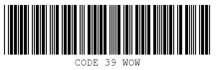         |
| barcode-itf4       | ITF-14     | Encodes 14 digits. The last digit is a checksum. If the last digit is not specified, it'll be automatically generated.                                                                                           | 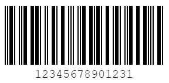           |
| barcode-msi        | MSI        | Encodes digits.                                                                                                                                                                                                  | 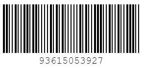               |
| barcode-msi10      | MSI 10     | Encodes digits. The checksum modulo 10 is done automatically.                                                                                                                                                    | 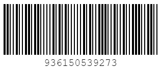           |
| barcode-msi11      | MSI 11     | Encodes digits. The checksum modulo 11 is done automatically.                                                                                                                                                    | 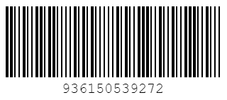           |
| barcode-msi1010    | MSI 1010   | Encodes digits. The checksum modulo 1010 is done automatically.                                                                                                                                                  |        |
| barcode-msi1110    | MSI 1110   | Encodes digits. The checksum modulo 1110 is done automatically.                                                                                                                                                  | 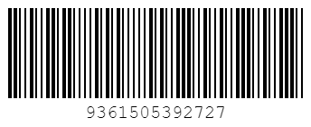       |
| barcode-pharmacode | Pharmacode | Encodes numbers from 3 to 131070.                                                                                                                                                                                | 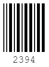 |
| barcode-codabar    | Codabar    | Encodes numbers and a number of special characters (`–`, `$`, `:`, `/`, `+`, `.`). You can set start and stop characters to `A`, `B`, `C` or `D` but if no start and stop character is defined `A` will be used. | 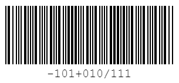       |

Note that some barcodes have certain limitation of the content, and if the provided contents doesn't match them, the barcode won't be displayed. For more details about the barcodes, you can check out [this resource](https://github.com/lindell/JsBarcode/wiki).